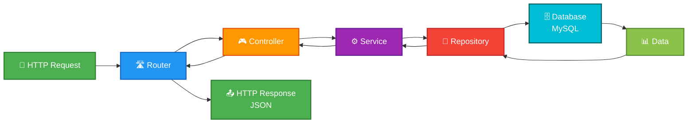

# TypeScript API MySQL

Uma API REST robusta para gerenciamento de usuários, construída com **TypeScript**, **Express.js** e **MySQL**.

## 📋 Sobre o Projeto

Este projeto implementa um servidor HTTP moderno que oferece endpoints RESTful para operações CRUD (Create, Read, Update, Delete) de usuários. A aplicação segue as melhores práticas de desenvolvimento com arquitetura em camadas, TypeScript tipado e gerenciamento robusto de erros.

## 🏗️ Arquitetura do Projeto

```
src/
├── index.ts                 # Ponto de entrada da aplicação
├── server.ts               # Configuração do servidor Express
├── controller/
│   └── UserController.ts   # Controlador de usuários (HTTP handlers)
├── service/
│   └── UserService.ts      # Lógica de negócio
├── repositories/
│   └── UserRepository.ts   # Acesso aos dados (banco de dados)
├── routes/
│   └── UserRoutes.ts       # Definição das rotas da API
└── settings/
    ├── config.ts           # Configurações da aplicação
    └── db.ts               # Conexão com banco de dados
```

## 🔄 Fluxo Principal da Aplicação



### Descrição das Camadas:

- **HTTP Request**: Cliente faz uma requisição para a API
- **Router**: Define as rotas e direciona a requisição para o controlador correto
- **Controller**: Recebe a requisição e coordena a resposta
- **Service**: Contém a lógica de negócio da aplicação
- **Repository**: Interage com o banco de dados
- **Database**: MySQL armazena e recupera os dados
- **HTTP Response**: A resposta é retornada ao cliente em JSON

## 🚀 Endpoints da API

### Listar todos os usuários

```http
GET /users
```

### Obter usuário por ID

```http
GET /users/:id
```

### Criar novo usuário

```http
POST /users
Content-Type: application/json

{
  "name": "João Silva",
  "email": "joao@example.com"
}
```

### Atualizar usuário

```http
PUT /users/:id
Content-Type: application/json

{
  "name": "João Silva Atualizado",
  "email": "joao.novo@example.com"
}
```

### Deletar usuário

```http
DELETE /users/:id
```

## 📦 Dependências

### Produção

- **express** (^5.2.1) - Framework web
- **mysql2** (^3.15.3) - Driver MySQL com Promises
- **dotenv** (^17.2.3) - Gerenciamento de variáveis de ambiente

### Desenvolvimento

- **typescript** (^5.9.3) - Linguagem TypeScript
- **ts-node-dev** (^2.0.0) - Executor de TypeScript em desenvolvimento
- **@types/express** (^5.0.6) - Tipos TypeScript para Express
- **@types/node** (^24.10.1) - Tipos TypeScript para Node.js
- **@tsconfig/node22** (^22.0.5) - Configuração TypeScript otimizada

## ⚙️ Configuração

### Pré-requisitos

- Node.js 22+ instalado
- MySQL Server ativo
- npm ou yarn instalado

### Instalação

1. Clone o repositório:

```bash
git clone https://github.com/OlluaS-code/Exercicio_TypeScript_Mysql.git
cd Exercicio_TypeScript_Mysql
```

2. Instale as dependências:

```bash
npm install
```

3. Configure as variáveis de ambiente:

Crie um arquivo `.env` na raiz do projeto com as seguintes variáveis:

```env
PORT=3000
NODE_ENV=development
DB_HOST=localhost
DB_USER=root
DB_PASS=sua_senha
DB_NAME=api_db
```

4. Configure o banco de dados:

Execute o arquivo `DB.sql` no MySQL:

```sql
CREATE DATABASE IF NOT EXISTS api_db;

USE api_db;

CREATE TABLE IF NOT EXISTS users (
    id INT AUTO_INCREMENT PRIMARY KEY,
    name VARCHAR(255) NOT NULL,
    email VARCHAR(255) NOT NULL UNIQUE
);
```

### Executar em Desenvolvimento

```bash
npm run dev
```

A aplicação iniciará em `http://localhost:3000`

### Compilar para Produção

```bash
npm run build
```

## 🔧 Estrutura de Classes

### UserController

Responsável por tratar requisições HTTP e retornar respostas:

- `getAll()` - Busca todas os usuários
- `getById(id)` - Busca usuário por ID
- `create(user)` - Cria novo usuário
- `update(id, user)` - Atualiza usuário existente
- `delete(id)` - Deleta usuário

### UserService

Contém a lógica de negócio:

- Valida operações
- Coordena chamadas ao repositório
- Implementa regras de negócio

### UserRepository

Interface com banco de dados:

- `findAll()` - Retorna todos os usuários
- `findById(id)` - Busca usuário por ID
- `create(user)` - Insere novo usuário
- `update(id, user)` - Atualiza usuário
- `delete(id)` - Remove usuário

### Database

Gerencia conexão com MySQL usando Pool:

- Implementa padrão Singleton
- Reutiliza conexões
- Limite de 10 conexões simultâneas

## 🎯 Padrões de Projeto

- **MVC (Model-View-Controller)**: Separação de responsabilidades
- **Repository Pattern**: Abstração de acesso a dados
- **Dependency Injection**: Injeção de dependências nas classes
- **Singleton Pattern**: Uma única instância da conexão com banco de dados

## 📝 Licença

ISC

## 👤 Autor

Desenvolvido por [Saullo Moura Tavares]

## 📞 Contato

Saullo - [GitHub](https://github.com/OlluaS-code) - [LinkedIn](https://linkedin.com/in/olluas-code/) - [WhatsApp](https://olluas-code.github.io/contato.html)

---

## 🤝 Contribuições

Contribuições são bem-vindas! Sinta-se à vontade para abrir issues e pull requests.

---

**Última atualização**: Fevereiro de 2026
